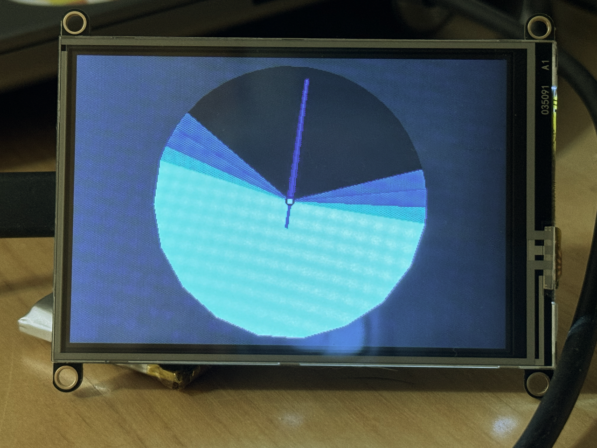

## Fun With Microcontrollers
### Building a digital sundial using Python

 Scott Irwin

&nbsp;

 

&nbsp;
https://sjirwin.github.io/fun-with-microcontrollers/

------

## About Me

- Bloomberg Engineering
  - Joined in 2014 as Senior Engineer and Team Lead
  - Python educator
  - Python Guild Leader since 2018
    - Co-chair since 2021

===

# Digital Sundial

------

## What We Are Building

------

## What We Need To Get There

- Data
- Hardware
- Python !

===

# Data

------

## Working Title

===

# Hardware

------

## Working Title

===

# Python

------

## Working Title

===

## References

  - This talk: [https://sjirwin.github.io/fun-with-microcontrollers](https://sjirwin.github.io/fun-with-microcontrollers)
  - Project Repo: [https://github.com/sjirwin/fun-with-microcontrollers](https://github.com/sjirwin/fun-with-microcontrollers)
    - Code: `main` branch
    - Slides: `gh-pages` branch
