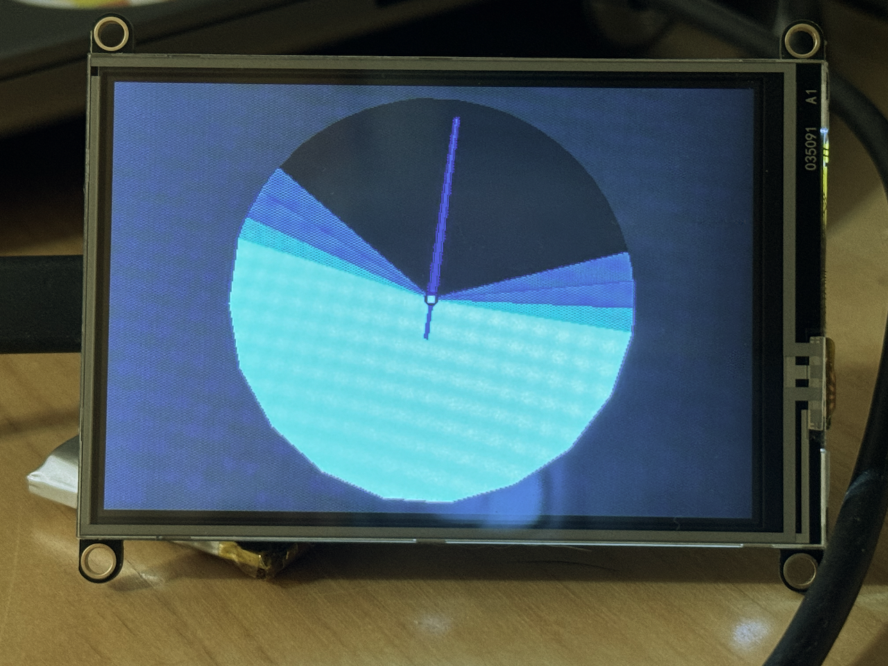

## Fun With Microcontrollers
### Building a digital sundial using Python

<center>
<br/>Scott Irwin
<p>&nbsp;

<br/>
<p>&nbsp;
https://sjirwin.github.io/fun-with-microcontrollers/
</center>

------

## About Me

- Bloomberg Engineering
  - Joined in 2014 as Senior Engineer and Team Lead
  - Python educator
  - Python Guild Leader since 2018
    - Co-chair since 2021

===

# Digital Sundial

------

## What We Are Building



------

## What We Need To Get There

- Data
- Hardware
- Python !

===

# Data

------

## Sun Event Times

- Using API provided by https://sunrise-sunset.org/
  - They have a simple, free REST API
  - Usage limited to "reasonable volume"
  - **They require that you show attribution to them with a link to their site**

------

## Using The API

- Send a GET request to https://api.sunrise-sunset.org/json
- Request parameters
  - Latitude and longitude as decimal degrees
  - Date (YYYY-MM-DD)
  - Timezone identifier (e.g., Asia/Tokyo)
  - Format option

------

## Sample data

```text
{
  'astronomical_twilight_begin': '2024-08-24T04:36:51-04:00',
  'astronomical_twilight_end': '2024-08-24T21:19:26-04:00',
  'civil_twilight_begin': '2024-08-24T05:47:25-04:00',
  'civil_twilight_end': '2024-08-24T20:08:51-04:00',
  'day_length': 48430,
  'nautical_twilight_begin': '2024-08-24T05:13:06-04:00',
  'nautical_twilight_end': '2024-08-24T20:43:11-04:00',
  'solar_noon': '2024-08-24T12:58:08-04:00',
  'sunrise': '2024-08-24T06:14:33-04:00',
  'sunset': '2024-08-24T19:41:43-04:00'
}
```

------

## Mapping The Data


===

# Hardware

------

## Requirements

- Microcontroller board that supports  Python
- Display
- Real-time Clock (RTC)
  - Maintains the date/time while system is powered off
- Wifi
  - Connect to the internet to retrieve the solar event data

------

## Hardware Chosen

- Adafruit Feather boards
  - Reduced the soldering needed
  - Boards are designed to be stacked
- [Adafruit ESP32-S2 Feather](https://www.adafruit.com/product/5303)
  - CircuitPython support
  - Built-in wifi
- [DS3231 Precision RTC FeatherWing](https://www.adafruit.com/product/3028)
- [Adafruit TFT FeatherWing 3.5" V2](https://www.adafruit.com/product/3651)
  - 480x320 pixels

===

# Python

------

## CircuitPython

- Fork of MicroPython
  - Beginner friendly
- Integrated into boot loader for the microcontroler board
- Large number of modules available
- Seperate boot loader for each board
  - Not all of CPython modules supported

------

## ESP32-S2 - Modules Included

- Standard Library
  - `collections`, `math`, `ssl`, `time`
  - `os` (`os.getenv`)
- CircuitPython Libraries
  - `adafruit_bus_device` (needed to talk to FeatherWings)
  - `displayio`, `fourwire`
  - `rtc`
  - `socketpool`, `wifi`

------

## Additional Modules

- `tzdb`,  `adafruit_datetime`, `adafruit_itertools`
- **RTC:** `adafruit_ds3231`, `adafruit_register`
- **Display:** `adafruit_hx8357`, `adafruit_display_shapes`
- **Wifi:** `adafruit_connection_manager`, `adafruit_requests`

------

## `code.py` - Application Flow

- Define location (lat, long, timezone)
- Initialize local RTC from FeatherWing RTC
- Get current date
- Initialize display
- Create and show initial graphical elements
- Loop forever
  - Update time indicator
  - If new day, update the sun dial segments

------

## Define Location

`code.py`
```python
BROOKLYN_NY_USA = Location(40.6928, -73.9903, 'America/New_York')
TOKYO_JAPAN = Location(35.6897, 139.6922, 'Asia/Tokyo')

LOCATION = TOKYO_JAPAN
```

`location.py`
```python
class Location():
    def __init__(self, lat, long, tzid):
        self.lat = lat
        self.long = long
        self.tzid = tzid
```

------

## Initialize Local RTC

`code.py`
```python
# use the external real-time clock (RTC) to initialize the local RTC
rtc.RTC().datetime = my_rtc.current_utc_time(i2c=board.I2C())
```

`my_rtc.py`
```python
import adafruit_ds3231

def current_utc_time(i2c):
    ds3231 = adafruit_ds3231.DS3231(i2c)
    return ds3231.datetime
```

Note:
I2C: Inter-Integrated Circuit - synchronous serial communication bus

------

## Get Current Date

`code.py`
```python
from tzdb import timezone
from adafruit_datetime import datetime

def localtime(tzid: str = LOCATION.tzid) -> datetime:
    utc_now_dt = datetime.fromtimestamp(time.time())
    return utc_now_dt + timezone(tzid).utcoffset(utc_now_dt)

# current date
date = localtime().date()
```

------

## Initialize Display - `code.py`

```python
# Release any resources currently in use for the display
displayio.release_displays()

# connect the board to the display
display = my_display.get_display(board)

# define the center of the display
W2 = display.width // 2
H2 = display.height // 2

# size of the digital sundial
RADIUS = 0.95 * min(W2, H2)
```

------

## `my_display.py`

```python
import displayio, adafruit_hx8357

def get_display(board):
    # board details needed to talk to the display
    spi, tft_cs, tft_dc = board.SPI(), board.D9, board.D10

    # connect to the display
    display_bus = displayio.FourWire(
        spi, command=tft_dc, chip_select=tft_cs)
    display_width, display_height = 480, 320
    display = adafruit_hx8357.HX8357(
      display_bus, width=display_width, height=display_height)
    return display
```

------

## Initial graphical elements

```python
# create the top level display group
root_group = displayio.Group()
display.root_group = root_group

# set the background
root_group.append(display_background(display))

# arcs for solar day events
arcs = create_arcs(date, LOCATION, RADIUS)
root_group.append(arc_group(arcs))

# sun dial time indicator
pts = now_pts(angle=now_angle(), radius=RADIUS)
root_group.append(indicator_group(pts))
```

------

## `arc_group()`

```python
def arc_group(arcs: list[Arc]) -> displayio.Group:
    group = displayio.Group()
    for arc in arcs:
        group.append(arc)
    return group
```

------

## `create_arcs()`

```python
def create_arcs(date: datetime.date, location: Location, radius: float) -> list[Arc]:
    # time of each solar day event for date and location
    events = sun_events.sunevents(date, location)
    # calculate duration (in secs) of each solar day event
    durations = event_durations.durations(events)
    # data needed to calculate arc paramters
    arc_start_pts = list(itertools.accumulate([0]+durations, func=lambda x, y: x + y))
    arc_mid_pts = [d // 2 for d in durations]
    # calculate parameters needed to draw the arcs
    arc_colors = [BLACK, DARK_GREY, GREY, LIGHT_GREY, WHITE, LIGHT_GREY, GREY, DARK_GREY, BLACK]
    arc_directions = [
      90 - (360 * (start + mid) / TOTAL_SECONDS)
      for start, mid in zip(arc_start_pts, arc_mid_pts)
    ]
    arc_angle_lens = [360 * dur / TOTAL_SECONDS for dur in durations]
    arcs = [
      Arc(
        x=W2, y=H2, radius=radius, arc_width=radius,
        angle=angle, direction=direction, fill=color,
        segments=min(10, int(5 * angle)) )
      for color, direction, angle
      in zip(arc_colors, arc_directions, arc_angle_lens)
    ]
    return arcs
```

------

## `sunevents()`

```python
import sun_events_data_board as events_data

def sunevents(date: datetime.date, loc: Location) -> SunEvents:
    data = events_data.sunrise_sunset_json(date, loc)
    # unpack the json and create datetime objects
    ...
    # construct and return SunEvents object which holds all the datetimes
    return SunEvents(...)
  ```

------

## `sunrise_sunset_json()`

```python
import adafruit_datetime as datetime
import os, wifi, socketpool, adafruit_requests
from location import Location

# connect to SSID
wifi.radio.connect(os.getenv('CIRCUITPY_WIFI_SSID'), os.getenv('CIRCUITPY_WIFI_PASSWORD'))
pool = socketpool.SocketPool(wifi.radio)
requests = adafruit_requests.Session(pool, ssl.create_default_context())

def sunrise_sunset_json(date: datetime.date, loc: Location):
    time_data = _call_api_sunrise_sunset_org(str(date), loc.lat, loc.long, loc.tzid)
    return time_data['results']

def _call_api_sunrise_sunset_org(date: str, lat: float, lng: float, tzid: str):
    url = f"https://api.sunrise-sunset.org/json?{lat=}&{lng=}&{tzid=}&{date=}&formatted=0"
    resp = requests.get(url)
    ... # error checks
    time_data = resp.json()
    resp.close()
    return time_data
```

------

## Loop Forever

```python
previous_date = date
previous_pts = pts
while True:
    # wait a minute
    time.sleep(60.0)
    date = localtime().date()
    # if new date, update the arc display group
    if date > previous_date:
        arcs = create_arcs(date, LOCATION, RADIUS)
        root_group[1] = arc_group(arcs)
        previous_date = date
    # calculate the coordinates for the indicator
    pts = now_pts(angle=now_angle(), radius=RADIUS)
    # if the pts have changed, update the indicator display group
    if pts != previous_pts:
        root_group[2] = indicator_group(pts)
        previous_pts = pts
```

===

# Wrapping Up

------

## Working Title

------

## What is Missing

- GPS to get current location

------

## References

  - This talk
    - [https://sjirwin.github.io/fun-with-microcontrollers](https://sjirwin.github.io/fun-with-microcontrollers)
  - Project Repo
    - [https://github.com/sjirwin/fun-with-microcontrollers](https://github.com/sjirwin/fun-with-microcontrollers)
      - Code: on `main` branch
      - Slides: on `gh-pages` branch
  - [https://sunrise-sunset.org](https://sunrise-sunset.org)
  - CircuitPython: [https://circuitpython.org//](https://circuitpython.org//)
  - AdaFruit: [https://www.adafruit.com](https://www.adafruit.com)
