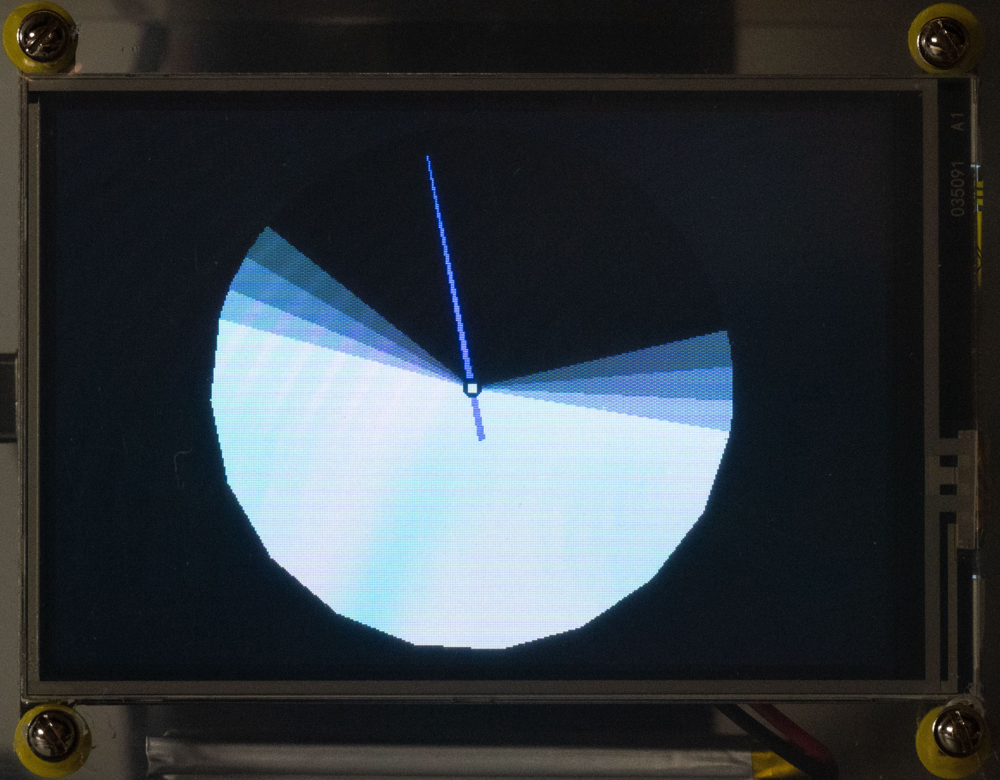

## Fun With Microcontrollers
### Building a digital sundial using Python

<center>
<br/>Scott Irwin
<p>&nbsp;

<br/>
<p>&nbsp;
https://sjirwin.github.io/fun-with-microcontrollers/
</center>

------

## About Me

- Bloomberg Engineering
  - Joined in 2014 as Senior Engineer and Team Lead
  - Python educator
  - Python Guild Leader since 2018
    - Co-chair since 2021

===

# Digital Sundial

------

## What We Are Building



------

## What We Need To Get There

- Data
- Hardware
- Python !

===

# Data

------

## Sun Event Times

- Using API provided by https://sunrise-sunset.org/
  - They have a simple, free REST API
  - Usage limited to "reasonable volume"
    - We only need the data once per day and when the device starts up
  - **They require that you show attribution to them with a link to their site**

------

## Using The API

- Send a GET request to https://api.sunrise-sunset.org/json
- Request parameters
  - Latitude and longitude as decimal degrees
  - Date (YYYY-MM-DD)
  - Timezone identifier (e.g., Asia/Tokyo)
  - Format option

------

## Sample data

```js
{
  'astronomical_twilight_begin': '2024-08-24T04:36:51-04:00',
  'astronomical_twilight_end': '2024-08-24T21:19:26-04:00',
  'civil_twilight_begin': '2024-08-24T05:47:25-04:00',
  'civil_twilight_end': '2024-08-24T20:08:51-04:00',
  'day_length': 48430,
  'nautical_twilight_begin': '2024-08-24T05:13:06-04:00',
  'nautical_twilight_end': '2024-08-24T20:43:11-04:00',
  'solar_noon': '2024-08-24T12:58:08-04:00',
  'sunrise': '2024-08-24T06:14:33-04:00',
  'sunset': '2024-08-24T19:41:43-04:00'
}
```

------

## Mapping The Data


------

## Displaying The Data


===

# Hardware

------

## Requirements

- Microcontroller board that supports  Python
- Display
- Real-time Clock (RTC)
  - Maintains the date/time while system is powered off
- Wi-Fi
  - Connect to the internet to retrieve the solar event data

------

## Hardware Chosen

### Adafruit Feather boards

<br/>

|   |   |   |
| --- | --- | --- |
| Microcontroller Board | [Adafruit ESP32-S2 Feather](https://www.adafruit.com/product/5303) | Built-in Wi-Fi |
| RTC | [DS3231 Precision RTC FeatherWing](https://www.adafruit.com/product/3028) | |
| Display | [Adafruit TFT FeatherWing 3.5" V2](https://www.adafruit.com/product/3651) | 480x320 pixels |

===

# Python

------

## Python On Microcontrollers

**Directly access**
- Microcontroller board components
- Low level components
  - Sensors
  - Displays
  - Cameras
  - Motors
  - Accelerometers

------

## Limitations

- Some Python Standard Library modules are not available
  - Examples
    - <span style="color:indianred">`dataclasses`</span>
    - <span style="color:indianred">`enum`</span>
- Some modules require special versions
  - Examples
    - <span style="color:indianred">`adafruit_datetime`</span>
    - <span style="color:indianred">`adafruit_requests`</span>

------

## CircuitPython

- Fork of MicroPython
  - Beginner friendly
- Integrated into boot loader for the microcontroller board
  - Separate boot loader for each board ([example](https://circuitpython.org/board/adafruit_feather_esp32s2/))
- Large number of modules available

------

## ESP32-S2

### Included Modules That Were Used

- Standard Library
  - <span style="color:indianred">`collections`</span>, <span style="color:indianred">`math`</span>, <span style="color:indianred">`ssl`</span>, <span style="color:indianred">`time`</span>
  - <span style="color:indianred">`os`</span> (<span style="color:indianred">`os.getenv`</span>)
- CircuitPython Libraries
  - <span style="color:indianred">`board`</span>
  - <span style="color:indianred">`adafruit_bus_device`</span> (needed to talk to FeatherWings)
  - <span style="color:indianred">`displayio`</span>, <span style="color:indianred">`fourwire`</span>
  - <span style="color:indianred">`rtc`</span>
  - <span style="color:indianred">`socketpool`</span>, <span style="color:indianred">`wifi`</span>

------

## Some Additional Modules

- **General**
  - <span style="color:indianred">`adafruit_itertools`</span>
- **Datetime**
  - <span style="color:indianred">`tzdb`</span>,  <span style="color:indianred">`adafruit_datetime`</span>
- **RTC**
  - <span style="color:indianred">`adafruit_ds3231`</span>, <span style="color:indianred">`adafruit_register`</span>
- **Display**
  - <span style="color:indianred">`adafruit_hx8357`</span>, <span style="color:indianred">`adafruit_display_shapes`</span>
- **Wi-Fi**
  - <span style="color:indianred">`adafruit_connection_manager`</span>, <span style="color:indianred">`adafruit_requests`</span>

------

## <span style="color:indianred">`board`</span> Module

- Built into CircuitPython
- Provides access to board-specific objects
  - Individual pins
    - <span style="color:darkgreen">`board.D9`</span>
    - <span style="color:darkgreen">`board.D10`</span>
  - Protocol busses
    - <span style="color:darkgreen">`board.I2C()`</span> : I2C serial bus
    - <span style="color:darkgreen">`board.SPI()`</span> : Serial Peripheral Interface

------

## Serial Communications

### Inter-Integrated Circuit (I2C)

- 2 Wire synchronous serial bus
- Used by the microcontroller to communicate with lower-speed peripherals

<p>&nbsp;

```python
ds3231 = adafruit_ds3231.DS3231(board.I2C()) # RTC
```

------

## Serial Communications

### Serial Peripheral Interface (SPI)

- 4 wire synchronous serial bus
- Full duplex

<p>&nbsp;

```python
display_bus = displayio.FourWire(board.SPI(), chip_select=board.D9, command=board.D10)
```

------

## Application Flow

### `code.py`

- Define location (lat, long, timezone)
- Initialize on-board RTC from FeatherWing RTC
- Get current date
- Initialize display
- Create and show initial graphical elements
  - Solar day segments
  - Time indicator
- Loop forever
  - Update time indicator
  - On Date change, update the solar day segments

------

## Initialize On-Board RTC

`code.py`
```python
# use the external real-time clock (RTC) to initialize the local RTC
rtc.RTC().datetime = my_rtc.current_utc_time(board.I2C())
```

<p>&nbsp;

`my_rtc.py`
```python
import adafruit_ds3231

def current_utc_time(i2c):
    ds3231 = adafruit_ds3231.DS3231(i2c)
    return ds3231.datetime
```

------

## Initialize Display

`code.py`
```python
# connect the board to the display
display = my_display.display(board)
```

<p>&nbsp;

`my_display.py`

```python
import displayio, adafruit_hx8357

def display(board):
    # board details needed to talk to the display
    spi, tft_cs, tft_dc = board.SPI(), board.D9, board.D10

    # connect to the display
    display_bus = displayio.FourWire(spi, command=tft_dc, chip_select=tft_cs)
    width, height = 480, 320
    display = adafruit_hx8357.HX8357(display_bus, width=width, height=height)

    return display
```

------

## Graphical Elements

- Shown using <span style="color:indianred">`displayio`</span> module ([docs](https://docs.circuitpython.org/en/latest/shared-bindings/displayio/index.html))
- Element objects created using <span style="color:indianred">`adafruit_display_shapes`</span> module ([docs](https://docs.circuitpython.org/projects/display-shapes/en/latest/index.html))
  - <span style="color:darkgreen">`Arc()`</span> for each solar day segment
    - Arc lengths are calculated using each segment's relative duration
  - <span style="color:darkgreen">`Triangle()`</span> for time indicator

===

# Wrapping Up

------

## Summary

- Python provides an easy way to get started programming embedded systems
- With some data, a small amount of microcontroller hardware, and a bit of Python, was able to build a portable IoT device with a graphical display

------

## Possible Enhancements

- Show date on screen
- Add hash marks to show hour on sun dial face
- Add GPS to get current location
  - Requires external antenna

------

## References

  - This talk
    - [https://sjirwin.github.io/fun-with-microcontrollers](https://sjirwin.github.io/fun-with-microcontrollers)
  - Project Repo
    - [https://github.com/sjirwin/fun-with-microcontrollers](https://github.com/sjirwin/fun-with-microcontrollers)
      - Code: `main` branch
      - Slides: `gh-pages` branch
  - Solar Day Data: [https://sunrise-sunset.org](https://sunrise-sunset.org)
  - CircuitPython: [https://circuitpython.org](https://circuitpython.org)
  - AdaFruit: [https://www.adafruit.com](https://www.adafruit.com)
